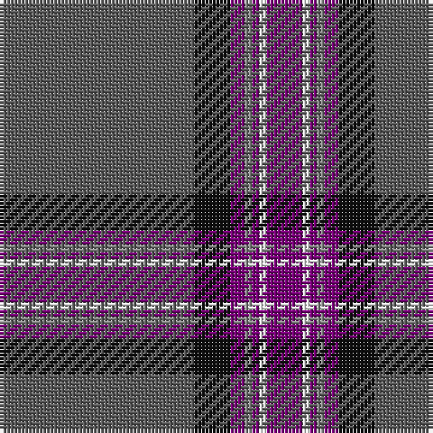

The parent of this is [Caledonian Mist](/tartans/n/54/k10/p4/na2/p2/w2/p/10/)

This was sourced from tartans-authority.  It is a [7 stripes tartan](/stripes/stripes7/).

Original link http://www.tartansauthority.com/tartan-ferret/display/11287/

## Thread count
N/54 K10 P4 Na2 P2 W2 P/10

## Palette
Each colour and its ΔE from the base-6 reference it is a variant of.

| Colour | Shade | Base | ΔE (OKLab) |
|---|---|---|---|
| K |  `#101010` | K  | 0.17 |
| N |  `#5C5C5C` | B  | 0.14 |
| Na |  `#888888` | R  | 0.24 |
| P |  `#780078` | B  | 0.16 |
| W |  `#FCFCFC` | W  | 0.03 |

# Sample pattern

ID: /variants/n/54/k10/p4/na2/p2/w2/p/10-k101010-n5c5c5c-na888888-p780078-wfcfcfc/
