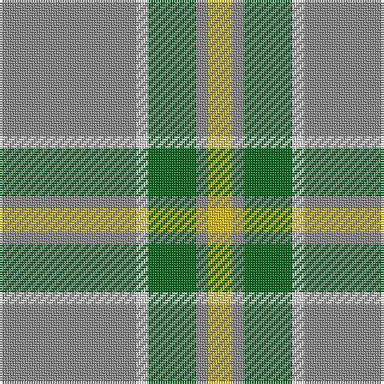

The parent of this is [Jahore District Tartan Tartan Number: 1309. Earliest known date: c.1890 [50% actual count] Reputed to have been presented to the Sultan of Jahore by Queen Victoria during his visit to Balmoral around 1890. See products available Copyright © Blair Urquhart, Comrie, 2015](/tartans/n/57/ln5/g20/n5/y/10/)

This was sourced from house-of-tartan.  It is a [5 stripes tartan](/stripes/stripes5/).

Original link http://www.house-of-tartan.scotland.net/house/TartanViewjs.asp?colr=Def&tnam=1309

## Thread count
N/57 LN5 G20 N5 Y/10

## Palette
Each colour and its ΔE from the base-6 reference it is a variant of.

| Colour | Shade | Base | ΔE (OKLab) |
|---|---|---|---|
| G |  `#006818` | G  | 0.02 |
| LN |  `#E0E0E0` | W  | 0.06 |
| N |  `#888888` | R  | 0.24 |
| Y |  `#E8C000` | Y  | 0.00 |

# Sample pattern

ID: /variants/n/57/ln5/g20/n5/y/10-g006818-lne0e0e0-n888888-ye8c000/
