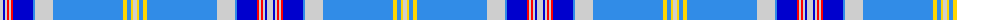

The parent of this is [De Clercq, Christian Family (Belgium)](/tartans/n/6/b2/n2/r2/n2/r2/b20/ba2/n18/ba70/y4/ba4/y2/n/4/)

This was sourced from register-of-tartans.  It is a [14 stripes tartan](/stripes/stripes14/).

Original link https://www.tartanregister.gov.uk/tartanDetails.aspx?ref=10741

## Thread count
N/6 B2 N2 R2 N2 R2 B20 Ba2 N18 Ba70 Y4 Ba4 Y2 N/4

## Palette
Each colour and its ΔE from the base-6 reference it is a variant of.

| Colour | Shade | Base | ΔE (OKLab) |
|---|---|---|---|
| B |  `#0000CD` | B  | 0.15 |
| Ba |  `#318CE7` | B  | 0.24 |
| N |  `#CECECE` | W  | 0.11 |
| R |  `#FF0000` | R  | 0.11 |
| Y |  `#FFD700` | Y  | 0.07 |

ID: /variants/n/6/b2/n2/r2/n2/r2/b20/ba2/n18/ba70/y4/ba4/y2/n/4-b0000cd-ba318ce7-ncecece-rff0000-yffd700/
