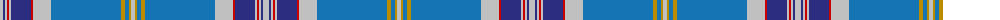

The parent of this is [De Clercq, Christian (Belgium)](/tartans/n/6/db2/n2/r2/n2/db20/r2/n18/b70/dy4/b4/dy2/n/4/)

This was sourced from tartans-authority.  It is a [13 stripes tartan](/stripes/stripes13/).

Original link http://www.tartansauthority.com/tartan-ferret/display/10741/

## Thread count
N/6 DB2 N2 R2 N2 DB20 R2 N18 B70 DY4 B4 DY2 N/4

## Palette
Each colour and its ΔE from the base-6 reference it is a variant of.

| Colour | Shade | Base | ΔE (OKLab) |
|---|---|---|---|
| B |  `#1474B4` | B  | 0.15 |
| DB |  `#2C2C80` | B  | 0.05 |
| DY |  `#BC8C00` | Y  | 0.16 |
| N |  `#C0C0C0` | W  | 0.16 |
| R |  `#C80000` | R  | 0.00 |

ID: /variants/n/6/db2/n2/r2/n2/db20/r2/n18/b70/dy4/b4/dy2/n/4-b1474b4-db2c2c80-dybc8c00-nc0c0c0-rc80000/
