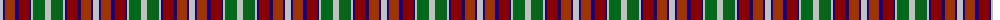

The parent of this is [Wombles 7 (Corporate)](/tartans/n/6/db2/r10/db4/dr10/db2/n2/g12/n/6/)

This was sourced from tartans-authority.  It is a [9 stripes tartan](/stripes/stripes9/).

Original link http://www.tartansauthority.com/tartan-ferret/display/4242/

## Thread count
N/6 DB2 R10 DB4 DR10 DB2 N2 G12 N/6

## Palette
Each colour and its ΔE from the base-6 reference it is a variant of.

| Colour | Shade | Base | ΔE (OKLab) |
|---|---|---|---|
| DB |  `#1C0070` | B  | 0.14 |
| DR |  `#880000` | R  | 0.14 |
| G |  `#006818` | G  | 0.02 |
| N |  `#C0C0C0` | W  | 0.16 |
| R |  `#A03400` | R  | 0.08 |

ID: /variants/n/6/db2/r10/db4/dr10/db2/n2/g12/n/6-db1c0070-dr880000-g006818-nc0c0c0-ra03400/
