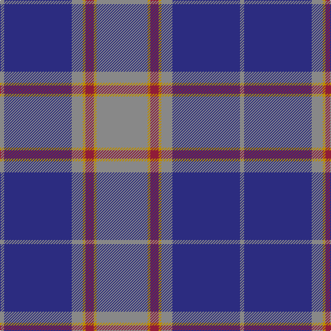

The parent of this is [U.S. Merchant Marine Academy](/tartans/n/6/db98/n16/dy4/dr12/dy4/n/74/)

This was sourced from register-of-tartans.  It is a [7 stripes tartan](/stripes/stripes7/).

Original link https://www.tartanregister.gov.uk/tartanDetails.aspx?ref=5730

## Thread count
N/6 DB98 N16 DY4 DR12 DY4 N/74

## Palette
Each colour and its ΔE from the base-6 reference it is a variant of.

| Colour | Shade | Base | ΔE (OKLab) |
|---|---|---|---|
| B |  `#1474B4` | B  | 0.15 |
| DB |  `#2C2C80` | B  | 0.05 |
| DR |  `#901C38` | R  | 0.12 |
| DY |  `#BC8C00` | Y  | 0.16 |
| N |  `#888888` | R  | 0.24 |

# Sample pattern

ID: /variants/n/6/db98/n16/dy4/dr12/dy4/n/74-b1474b4-db2c2c80-dr901c38-dybc8c00-n888888/
