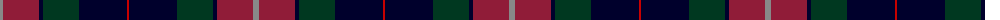
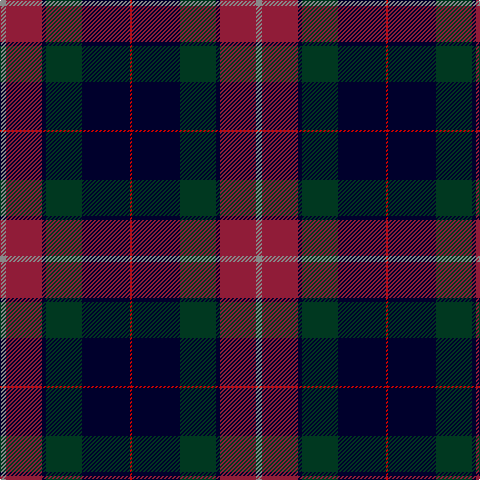

The parent of this is [205 (Scottish) Field Hospital (Mil.)](/tartans/n/6/dr36/db4/dg36/db48/r/2/)

This was sourced from tartans-authority.  It is a [6 stripes tartan](/stripes/stripes6/).

Original link http://www.tartansauthority.com/tartan-ferret/display/8371/

## Thread count
N/6 DR36 DB4 DG36 DB48 R/2

## Palette
Each colour and its ΔE from the base-6 reference it is a variant of.

| Colour | Shade | Base | ΔE (OKLab) |
|---|---|---|---|
| DB |  `#00002C` | K  | 0.16 |
| DG |  `#003820` | G  | 0.16 |
| DR |  `#901C38` | R  | 0.12 |
| N |  `#888888` | R  | 0.24 |
| R |  `#C80000` | R  | 0.00 |

# Sample pattern

ID: /variants/n/6/dr36/db4/dg36/db48/r/2-db00002c-dg003820-dr901c38-n888888-rc80000/
