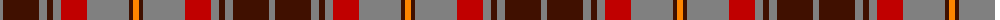

The parent of this is [Leitrim](/tartans/n/6/dr36/n8/dr6/n8/r26/n6/n36/dr4/o/6/)

This was sourced from weddslist.  It is a [10 stripes tartan](/stripes/stripes10/).

Original link http://www.weddslist.com/cgi-bin/tartans/pg.pl?source=sts

## Thread count
N/6 DR36 N8 DR6 N8 R26 N6 N36 DR4 O/6

## Palette
Each colour and its ΔE from the base-6 reference it is a variant of.

| Colour | Shade | Base | ΔE (OKLab) |
|---|---|---|---|
| DR |  `#401000` | B  | 0.23 |
| N |  `#808080` | G  | 0.22 |
| O |  `#FF8500` | Y  | 0.14 |
| R |  `#C00000` | R  | 0.02 |

ID: /variants/n/6/dr36/n8/dr6/n8/r26/n6/n36/dr4/o/6-dr401000-n808080-off8500-rc00000/
