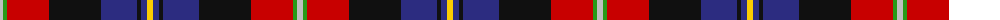
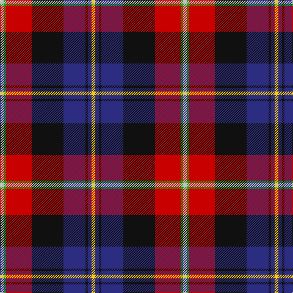

The parent of this is [Loch Etive](/tartans/n/6/g4/r42/k52/db36/k4/db6/y/6/)

This was sourced from tartans-authority.  It is a [8 stripes tartan](/stripes/stripes8/).

Original link http://www.tartansauthority.com/tartan-ferret/display/11056/

## Thread count
N/6 G4 R42 K52 DB36 K4 DB6 Y/6

## Palette
Each colour and its ΔE from the base-6 reference it is a variant of.

| Colour | Shade | Base | ΔE (OKLab) |
|---|---|---|---|
| DB |  `#2C2C80` | B  | 0.05 |
| G |  `#289C18` | G  | 0.18 |
| K |  `#101010` | K  | 0.17 |
| N |  `#C0C0C0` | W  | 0.16 |
| R |  `#C80000` | R  | 0.00 |
| Y |  `#FCCC00` | Y  | 0.04 |

# Sample pattern

ID: /variants/n/6/g4/r42/k52/db36/k4/db6/y/6-db2c2c80-g289c18-k101010-nc0c0c0-rc80000-yfccc00/
