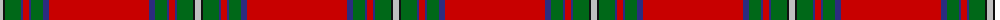

The parent of this is [MacAulay of Ardincaple (Clan)](/tartans/n/6/k2/g16/db2/r6/db2/g12/db6/r/100/)

This was sourced from tartans-authority.  It is a [9 stripes tartan](/stripes/stripes9/).

Original link http://www.tartansauthority.com/tartan-ferret/display/7120/

## Thread count
N/6 K2 G16 DB2 R6 DB2 G12 DB6 R/100

## Palette
Each colour and its ΔE from the base-6 reference it is a variant of.

| Colour | Shade | Base | ΔE (OKLab) |
|---|---|---|---|
| DB |  `#2C2C80` | B  | 0.05 |
| G |  `#006818` | G  | 0.02 |
| K |  `#101010` | K  | 0.17 |
| N |  `#C0C0C0` | W  | 0.16 |
| R |  `#C80000` | R  | 0.00 |

ID: /variants/n/6/k2/g16/db2/r6/db2/g12/db6/r/100-db2c2c80-g006818-k101010-nc0c0c0-rc80000/
