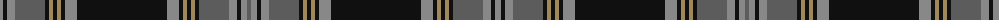

The parent of this is [Granton](/tartans/n/6/k4/n8/na30/k4/lt4/k4/lt4/k4/n12/k90/n12/k4/lt4/k4/lt4/k4/na30/n8/k4/n6/na/4/)

This was sourced from register-of-tartans.  It is a [22 stripes tartan](/stripes/stripes22/).

Original link https://www.tartanregister.gov.uk/tartanDetails.aspx?ref=1514

## Thread count
N/6 K4 N8 Na30 K4 LT4 K4 LT4 K4 N12 K90 N12 K4 LT4 K4 LT4 K4 Na30 N8 K4 N6 Na/4

## Palette
Each colour and its ΔE from the base-6 reference it is a variant of.

| Colour | Shade | Base | ΔE (OKLab) |
|---|---|---|---|
| K |  `#101010` | K  | 0.17 |
| LG |  `#C4BC68` | Y  | 0.07 |
| LT |  `#A08858` | Y  | 0.21 |
| N |  `#888888` | R  | 0.24 |
| Na |  `#5C5C5C` | B  | 0.14 |

ID: /variants/n/6/k4/n8/na30/k4/lt4/k4/lt4/k4/n12/k90/n12/k4/lt4/k4/lt4/k4/na30/n8/k4/n6/na/4-k101010-lgc4bc68-lta08858-n888888-na5c5c5c/
