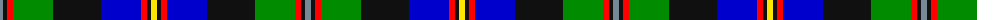

The parent of this is [Loch Awe](/tartans/n/6/k4/r6/g40/k48/b40/r6/k4/y/6/)

This was sourced from register-of-tartans.  It is a [9 stripes tartan](/stripes/stripes9/).

Original link https://www.tartanregister.gov.uk/tartanDetails.aspx?ref=10586

## Thread count
N/6 K4 R6 G40 K48 B40 R6 K4 Y/6

## Palette
Each colour and its ΔE from the base-6 reference it is a variant of.

| Colour | Shade | Base | ΔE (OKLab) |
|---|---|---|---|
| B |  `#0000CD` | B  | 0.15 |
| G |  `#008B00` | G  | 0.12 |
| K |  `#101010` | K  | 0.17 |
| N |  `#778899` | B  | 0.24 |
| R |  `#FF0000` | R  | 0.11 |
| Y |  `#FFE600` | Y  | 0.10 |

ID: /variants/n/6/k4/r6/g40/k48/b40/r6/k4/y/6-b0000cd-g008b00-k101010-n778899-rff0000-yffe600/
