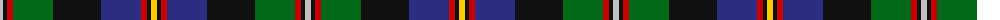

The parent of this is [Loch Awe](/tartans/n/6/k4/r6/g40/k48/db40/r6/k4/y/6/)

This was sourced from tartans-authority.  It is a [9 stripes tartan](/stripes/stripes9/).

Original link http://www.tartansauthority.com/tartan-ferret/display/10586/

## Thread count
N/6 K4 R6 G40 K48 DB40 R6 K4 Y/6

## Palette
Each colour and its ΔE from the base-6 reference it is a variant of.

| Colour | Shade | Base | ΔE (OKLab) |
|---|---|---|---|
| DB |  `#2C2C80` | B  | 0.05 |
| G |  `#006818` | G  | 0.02 |
| K |  `#101010` | K  | 0.17 |
| N |  `#C0C0C0` | W  | 0.16 |
| R |  `#C80000` | R  | 0.00 |
| Y |  `#FCCC00` | Y  | 0.04 |

ID: /variants/n/6/k4/r6/g40/k48/db40/r6/k4/y/6-db2c2c80-g006818-k101010-nc0c0c0-rc80000-yfccc00/
