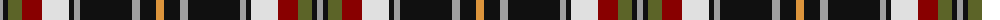

The parent of this is [Sligo County Crest (Fashion)](/tartans/n/6/k5/g14/dr20/ln27/k5/n6/k52/n8/k16/o/8/)

This was sourced from tartans-authority.  It is a [11 stripes tartan](/stripes/stripes11/).

Original link http://www.tartansauthority.com/tartan-ferret/display/7431/

## Thread count
N/6 K5 G14 DR20 LN27 K5 N6 K52 N8 K16 O/8

## Palette
Each colour and its ΔE from the base-6 reference it is a variant of.

| Colour | Shade | Base | ΔE (OKLab) |
|---|---|---|---|
| DR |  `#880000` | R  | 0.14 |
| G |  `#5C6428` | G  | 0.09 |
| K |  `#101010` | K  | 0.17 |
| LN |  `#E0E0E0` | W  | 0.06 |
| N |  `#A0A0A0` | Y  | 0.20 |
| O |  `#DC943C` | Y  | 0.12 |

ID: /variants/n/6/k5/g14/dr20/ln27/k5/n6/k52/n8/k16/o/8-dr880000-g5c6428-k101010-lne0e0e0-na0a0a0-odc943c/
