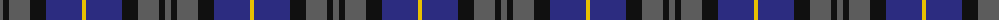
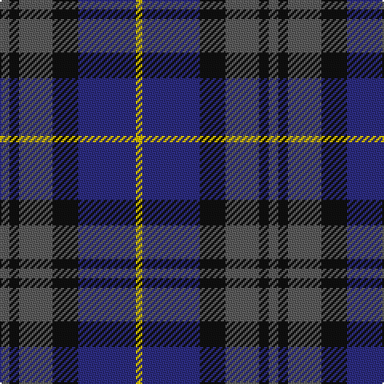

The parent of this is [Bareback (Corporate)](/tartans/n/6/k6/n21/k16/db36/y/4/)

This was sourced from tartans-authority.  It is a [6 stripes tartan](/stripes/stripes6/).

Original link http://www.tartansauthority.com/tartan-ferret/display/8054/

## Thread count
N/6 K6 N21 K16 DB36 Y/4

## Palette
Each colour and its ΔE from the base-6 reference it is a variant of.

| Colour | Shade | Base | ΔE (OKLab) |
|---|---|---|---|
| DB |  `#2C2C80` | B  | 0.05 |
| K |  `#101010` | K  | 0.17 |
| N |  `#5C5C5C` | B  | 0.14 |
| Y |  `#E8C000` | Y  | 0.00 |

# Sample pattern

ID: /variants/n/6/k6/n21/k16/db36/y/4-db2c2c80-k101010-n5c5c5c-ye8c000/
