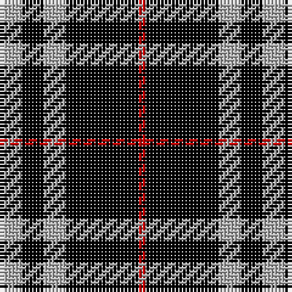

The parent of this is [Burberry, Black (Original) (Fashion)](/tartans/n/6/k6/n6/k20/r/2/)

This was sourced from tartans-authority.  It is a [5 stripes tartan](/stripes/stripes5/).

Original link http://www.tartansauthority.com/tartan-ferret/display/3768/

## Thread count
N/6 K6 N6 K20 R/2

## Palette
Each colour and its ΔE from the base-6 reference it is a variant of.

| Colour | Shade | Base | ΔE (OKLab) |
|---|---|---|---|
| K |  `#000000` | K  | 0.00 |
| N |  `#B0B0B0` | Y  | 0.18 |
| R |  `#C80000` | R  | 0.00 |

# Sample pattern

ID: /variants/n/6/k6/n6/k20/r/2-k000000-nb0b0b0-rc80000/
