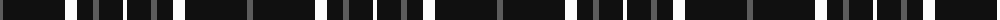

The parent of this is [Believe - Colette](/tartans/n/6/k62/w12/k16/n6/k24/w/4/)

This was sourced from tartans-authority.  It is a [7 stripes tartan](/stripes/stripes7/).

Original link http://www.tartansauthority.com/tartan-ferret/display/11004/

## Thread count
N/6 K62 W12 K16 N6 K24 W/4

## Palette
Each colour and its ΔE from the base-6 reference it is a variant of.

| Colour | Shade | Base | ΔE (OKLab) |
|---|---|---|---|
| K |  `#101010` | K  | 0.17 |
| N |  `#5C5C5C` | B  | 0.14 |
| W |  `#FCFCFC` | W  | 0.03 |

# Sample pattern

ID: /variants/n/6/k62/w12/k16/n6/k24/w/4-k101010-n5c5c5c-wfcfcfc/
