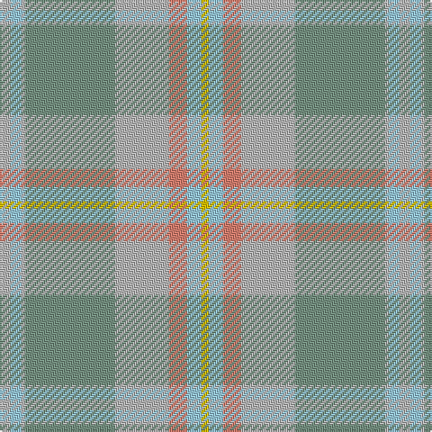

The parent of this is [Rikaco Morning Dew 2 (Fashion)](/tartans/n/6/lb6/n2/lg50/n30/lr10/lb8/y/4/)

This was sourced from tartans-authority.  It is a [8 stripes tartan](/stripes/stripes8/).

Original link http://www.tartansauthority.com/tartan-ferret/display/6392/

## Thread count
N/6 LB6 N2 LG50 N30 LR10 LB8 Y/4

## Palette
Each colour and its ΔE from the base-6 reference it is a variant of.

| Colour | Shade | Base | ΔE (OKLab) |
|---|---|---|---|
| LB |  `#98C8E8` | W  | 0.17 |
| LG |  `#789484` | G  | 0.23 |
| LR |  `#E08070` | Y  | 0.20 |
| N |  `#B8B8B8` | Y  | 0.17 |
| Y |  `#E8C000` | Y  | 0.00 |

# Sample pattern

ID: /variants/n/6/lb6/n2/lg50/n30/lr10/lb8/y/4-lb98c8e8-lg789484-lre08070-nb8b8b8-ye8c000/
