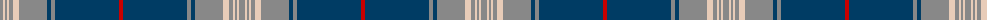

The parent of this is [Unknown](/tartans/n/6/lr2/n2/lr2/n4/lr6/n28/db4/n4/db64/r/4/)

This was sourced from tartans-authority.  It is a [11 stripes tartan](/stripes/stripes11/).

Original link http://www.tartansauthority.com/tartan-ferret/display/8684/

## Thread count
N/6 LR2 N2 LR2 N4 LR6 N28 DB4 N4 DB64 R/4

## Palette
Each colour and its ΔE from the base-6 reference it is a variant of.

| Colour | Shade | Base | ΔE (OKLab) |
|---|---|---|---|
| DB |  `#003C64` | B  | 0.07 |
| LR |  `#E8CCB8` | W  | 0.11 |
| N |  `#888888` | R  | 0.24 |
| R |  `#C80000` | R  | 0.00 |

ID: /variants/n/6/lr2/n2/lr2/n4/lr6/n28/db4/n4/db64/r/4-db003c64-lre8ccb8-n888888-rc80000/
