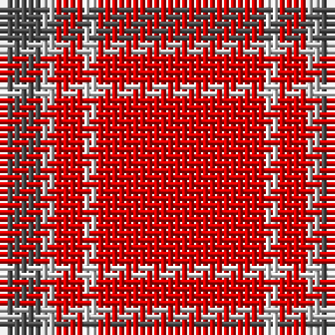

The parent of this is [Glenshee](/tartans/n/6/na2/r4/ln2/r/24/)

This was sourced from register-of-tartans.  It is a [5 stripes tartan](/stripes/stripes5/).

Original link https://www.tartanregister.gov.uk/tartanDetails.aspx?ref=1437

## Thread count
N/6 Na2 R4 LN2 R/24

## Palette
Each colour and its ΔE from the base-6 reference it is a variant of.

| Colour | Shade | Base | ΔE (OKLab) |
|---|---|---|---|
| LN |  `#E0E0E0` | W  | 0.06 |
| N |  `#505050` | B  | 0.12 |
| Na |  `#C0C0C0` | W  | 0.16 |
| R |  `#DC0000` | R  | 0.04 |

# Sample pattern

ID: /variants/n/6/na2/r4/ln2/r/24-lne0e0e0-n505050-nac0c0c0-rdc0000/
