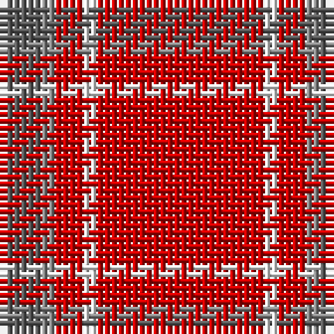

The parent of this is [Glen Shee Plaid (Fashion)](/tartans/n/6/na2/r4/w2/r/24/)

This was sourced from tartans-authority.  It is a [5 stripes tartan](/stripes/stripes5/).

Original link http://www.tartansauthority.com/tartan-ferret/display/1297/

## Thread count
N/6 Na2 R4 W2 R/24

## Palette
Each colour and its ΔE from the base-6 reference it is a variant of.

| Colour | Shade | Base | ΔE (OKLab) |
|---|---|---|---|
| N |  `#5C5C5C` | B  | 0.14 |
| Na |  `#888888` | R  | 0.24 |
| R |  `#C80000` | R  | 0.00 |
| W |  `#FCFCFC` | W  | 0.03 |

# Sample pattern

ID: /variants/n/6/na2/r4/w2/r/24-n5c5c5c-na888888-rc80000-wfcfcfc/
