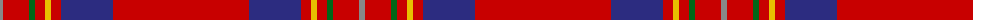

The parent of this is [de Nardi (Personal)](/tartans/n/6/r26/g6/r10/y6/r10/db52/r/136/)

This was sourced from tartans-authority.  It is a [8 stripes tartan](/stripes/stripes8/).

Original link http://www.tartansauthority.com/tartan-ferret/display/6187/

## Thread count
N/6 R26 G6 R10 Y6 R10 DB52 R/136

## Palette
Each colour and its ΔE from the base-6 reference it is a variant of.

| Colour | Shade | Base | ΔE (OKLab) |
|---|---|---|---|
| DB |  `#2C2C80` | B  | 0.05 |
| G |  `#006818` | G  | 0.02 |
| N |  `#888888` | R  | 0.24 |
| R |  `#C80000` | R  | 0.00 |
| Y |  `#E8C000` | Y  | 0.00 |

# Sample pattern

ID: /variants/n/6/r26/g6/r10/y6/r10/db52/r/136-db2c2c80-g006818-n888888-rc80000-ye8c000/
