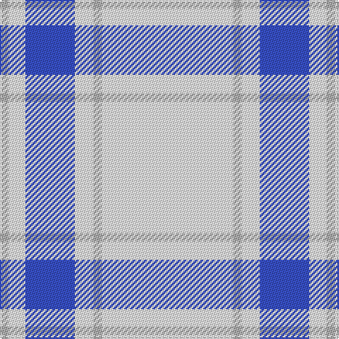

The parent of this is [Butties](/tartans/n/6/w12/b35/w13/n6/w/93/)

This was sourced from register-of-tartans.  It is a [6 stripes tartan](/stripes/stripes6/).

Original link https://www.tartanregister.gov.uk/tartanDetails.aspx?ref=10955

## Thread count
N/6 W12 B35 W13 N6 W/93

## Palette
Each colour and its ΔE from the base-6 reference it is a variant of.

| Colour | Shade | Base | ΔE (OKLab) |
|---|---|---|---|
| B |  `#3850C8` | B  | 0.12 |
| N |  `#B0B0B0` | Y  | 0.18 |
| W |  `#FFFFFF` | W  | 0.03 |

# Sample pattern

ID: /variants/n/6/w12/b35/w13/n6/w/93-b3850c8-nb0b0b0-wffffff/
