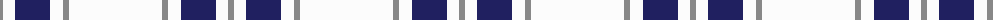

The parent of this is [Butties](/tartans/n/6/w12/db35/w13/n6/w/93/)

This was sourced from tartans-authority.  It is a [6 stripes tartan](/stripes/stripes6/).

Original link http://www.tartansauthority.com/tartan-ferret/display/10955/

## Thread count
N/6 W12 DB35 W13 N6 W/93

## Palette
Each colour and its ΔE from the base-6 reference it is a variant of.

| Colour | Shade | Base | ΔE (OKLab) |
|---|---|---|---|
| DB |  `#202060` | B  | 0.11 |
| N |  `#888888` | R  | 0.24 |
| W |  `#FCFCFC` | W  | 0.03 |

# Sample pattern

ID: /variants/n/6/w12/db35/w13/n6/w/93-db202060-n888888-wfcfcfc/
