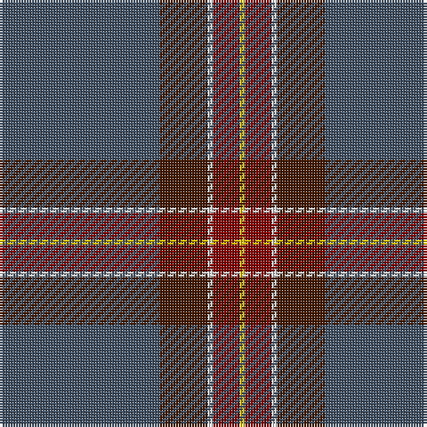

The parent of this is [Dunning Primary (School)](/tartans/n/60/dr18/ln2/dra10/y/2/)

This was sourced from tartans-authority.  It is a [5 stripes tartan](/stripes/stripes5/).

Original link http://www.tartansauthority.com/tartan-ferret/display/7875/

## Thread count
N/60 DR18 LN2 DRa10 Y/2

## Palette
Each colour and its ΔE from the base-6 reference it is a variant of.

| Colour | Shade | Base | ΔE (OKLab) |
|---|---|---|---|
| DR |  `#441800` | B  | 0.22 |
| DRa |  `#880000` | R  | 0.14 |
| LN |  `#E0E0E0` | W  | 0.06 |
| N |  `#405064` | B  | 0.09 |
| Y |  `#E8C000` | Y  | 0.00 |

# Sample pattern

ID: /variants/n/60/dr18/ln2/dra10/y/2-dr441800-dra880000-lne0e0e0-n405064-ye8c000/
