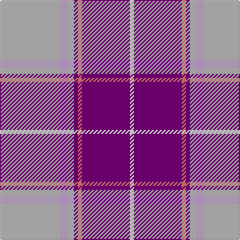

The parent of this is [St. Andrew's Links Dress (Corporate)](/tartans/n/60/lp8/n6/p4/lr4/p48/w/4/)

This was sourced from tartans-authority.  It is a [7 stripes tartan](/stripes/stripes7/).

Original link http://www.tartansauthority.com/tartan-ferret/display/10506/

## Thread count
N/60 LP8 N6 P4 LR4 P48 W/4

## Palette
Each colour and its ΔE from the base-6 reference it is a variant of.

| Colour | Shade | Base | ΔE (OKLab) |
|---|---|---|---|
| LP |  `#C49CD8` | W  | 0.24 |
| LR |  `#E87878` | R  | 0.19 |
| N |  `#B8B8B8` | Y  | 0.17 |
| P |  `#780078` | B  | 0.16 |
| W |  `#FCFCFC` | W  | 0.03 |

# Sample pattern

ID: /variants/n/60/lp8/n6/p4/lr4/p48/w/4-lpc49cd8-lre87878-nb8b8b8-p780078-wfcfcfc/
