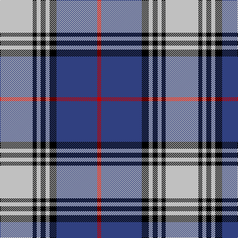

The parent of this is [Kinnaird](/tartans/n/66/k8/n8/k10/n8/k14/b82/r/8/)

This was sourced from weddslist.  It is a [8 stripes tartan](/stripes/stripes8/).

Original link http://www.weddslist.com/cgi-bin/tartans/pg.pl?source=sts

## Thread count
N/66 K8 N8 K10 N8 K14 B82 R/8

## Palette
Each colour and its ΔE from the base-6 reference it is a variant of.

| Colour | Shade | Base | ΔE (OKLab) |
|---|---|---|---|
| B |  `#304080` | B  | 0.01 |
| K |  `#000000` | K  | 0.00 |
| N |  `#C0C0C0` | W  | 0.16 |
| R |  `#C00000` | R  | 0.02 |

# Sample pattern

ID: /variants/n/66/k8/n8/k10/n8/k14/b82/r/8-b304080-k000000-nc0c0c0-rc00000/
