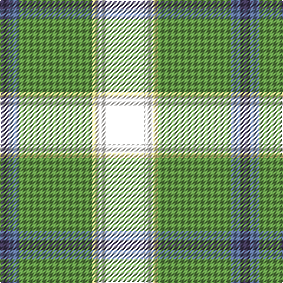

The parent of this is [Lethcoe (Thousand Oaks) (Personal)](/tartans/n/8/b8/lg62/ly4/w8/t/32/)

This was sourced from register-of-tartans.  It is a [6 stripes tartan](/stripes/stripes6/).

Original link https://www.tartanregister.gov.uk/tartanDetails.aspx?ref=10813

## Thread count
N/8 B8 LG62 LY4 W8 T/32

## Palette
Each colour and its ΔE from the base-6 reference it is a variant of.

| Colour | Shade | Base | ΔE (OKLab) |
|---|---|---|---|
| B |  `#5F749C` | B  | 0.17 |
| LG |  `#649848` | G  | 0.19 |
| LY |  `#F8E38C` | Y  | 0.11 |
| N |  `#433A5A` | B  | 0.08 |
| W |  `#F9F5EF` | W  | 0.01 |

# Sample pattern

ID: /variants/n/8/b8/lg62/ly4/w8/t/32-b5f749c-lg649848-lyf8e38c-n433a5a-wf9f5ef/
