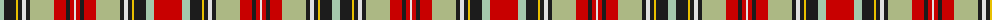

The parent of this is [Stuart/Stewart - Prince Charles Edward](/tartans/n/8/k12/y2/k4/ln4/k4/lg24/r12/k4/r4/ln2/r4/k4/r12/lg24/k4/ln4/k4/y2/k12/n8/r/28/)

This was sourced from register-of-tartans.  It is a [22 stripes tartan](/stripes/stripes22/).

Original link https://www.tartanregister.gov.uk/tartanDetails.aspx?ref=3991

## Thread count
N/8 K12 Y2 K4 LN4 K4 LG24 R12 K4 R4 LN2 R4 K4 R12 LG24 K4 LN4 K4 Y2 K12 N8 R/28

## Palette
Each colour and its ΔE from the base-6 reference it is a variant of.

| Colour | Shade | Base | ΔE (OKLab) |
|---|---|---|---|
| G |  `#006818` | G  | 0.02 |
| K |  `#1C1C1C` | B  | 0.20 |
| LG |  `#ACB884` | Y  | 0.12 |
| LN |  `#E0E0E0` | W  | 0.06 |
| N |  `#A4C8AC` | Y  | 0.15 |
| R |  `#C80000` | R  | 0.00 |
| Y |  `#E8C000` | Y  | 0.00 |

ID: /variants/n/8/k12/y2/k4/ln4/k4/lg24/r12/k4/r4/ln2/r4/k4/r12/lg24/k4/ln4/k4/y2/k12/n8/r/28-g006818-k1c1c1c-lgacb884-lne0e0e0-na4c8ac-rc80000-ye8c000/
