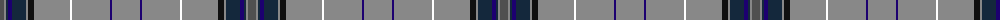

The parent of this is [Orkney Magnus](/tartans/n/8/na2/dn2/db4/dn14/na2/k6/na36/w2/na38/db2/na/28/)

This was sourced from register-of-tartans.  It is a [12 stripes tartan](/stripes/stripes12/).

Original link https://www.tartanregister.gov.uk/tartanDetails.aspx?ref=11158

## Thread count
N/8 Na2 DN2 DB4 DN14 Na2 K6 Na36 W2 Na38 DB2 Na/28

## Palette
Each colour and its ΔE from the base-6 reference it is a variant of.

| Colour | Shade | Base | ΔE (OKLab) |
|---|---|---|---|
| DB |  `#1C0070` | B  | 0.14 |
| DN |  `#14283C` | B  | 0.14 |
| K |  `#101010` | K  | 0.17 |
| N |  `#505050` | B  | 0.12 |
| Na |  `#888888` | R  | 0.24 |
| W |  `#FFFFFF` | W  | 0.03 |

ID: /variants/n/8/na2/dn2/db4/dn14/na2/k6/na36/w2/na38/db2/na/28-db1c0070-dn14283c-k101010-n505050-na888888-wffffff/
