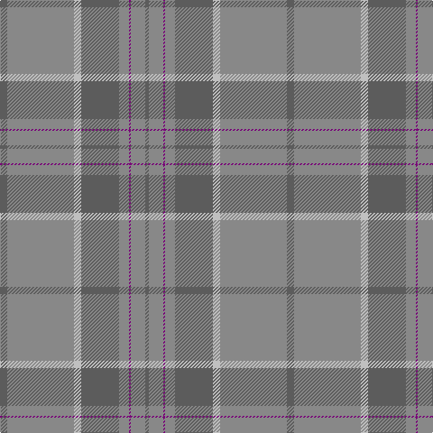

The parent of this is [Orkney Slate (Corporate)](/tartans/n/8/nb74/na8/n42/nb11/p2/nb16/n/4/)

This was sourced from tartans-authority.  It is a [8 stripes tartan](/stripes/stripes8/).

Original link http://www.tartansauthority.com/tartan-ferret/display/8669/

## Thread count
N/8 Nb74 Na8 N42 Nb11 P2 Nb16 N/4

## Palette
Each colour and its ΔE from the base-6 reference it is a variant of.

| Colour | Shade | Base | ΔE (OKLab) |
|---|---|---|---|
| N |  `#5C5C5C` | B  | 0.14 |
| Na |  `#C0C0C0` | W  | 0.16 |
| Nb |  `#888888` | R  | 0.24 |
| P |  `#780078` | B  | 0.16 |

# Sample pattern

ID: /variants/n/8/nb74/na8/n42/nb11/p2/nb16/n/4-n5c5c5c-nac0c0c0-nb888888-p780078/
