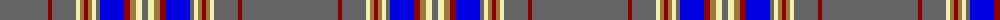

The parent of this is [Wcwm 1543](/tartans/n/96/dr4/n24/ly4/lt4/dr4/lt4/ly4/n4/b24/dr6/lt6/ly6/n/6/)

This was sourced from register-of-tartans.  It is a [14 stripes tartan](/stripes/stripes14/).

Original link https://www.tartanregister.gov.uk/tartanDetails.aspx?ref=4530

## Thread count
N/96 DR4 N24 LY4 LT4 DR4 LT4 LY4 N4 B24 DR6 LT6 LY6 N/6

## Palette
Each colour and its ΔE from the base-6 reference it is a variant of.

| Colour | Shade | Base | ΔE (OKLab) |
|---|---|---|---|
| B |  `#0000E0` | B  | 0.17 |
| DR |  `#8C0000` | R  | 0.13 |
| LT |  `#A0783C` | R  | 0.18 |
| LY |  `#F0F0B0` | W  | 0.08 |
| N |  `#646464` | B  | 0.16 |

ID: /variants/n/96/dr4/n24/ly4/lt4/dr4/lt4/ly4/n4/b24/dr6/lt6/ly6/n/6-b0000e0-dr8c0000-lta0783c-lyf0f0b0-n646464/
