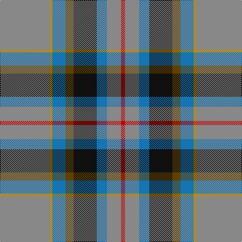

The parent of this is [State Seal of West Virginia (Fash)](/tartans/n/98/dy6/b26/t16/k46/b20/n28/r/8/)

This was sourced from tartans-authority.  It is a [8 stripes tartan](/stripes/stripes8/).

Original link http://www.tartansauthority.com/tartan-ferret/display/8663/

## Thread count
N/98 DY6 B26 T16 K46 B20 N28 R/8

## Palette
Each colour and its ΔE from the base-6 reference it is a variant of.

| Colour | Shade | Base | ΔE (OKLab) |
|---|---|---|---|
| B |  `#1474B4` | B  | 0.15 |
| DY |  `#BC8C00` | Y  | 0.16 |
| K |  `#101010` | K  | 0.17 |
| N |  `#888888` | R  | 0.24 |
| R |  `#C80000` | R  | 0.00 |
| T |  `#604000` | G  | 0.14 |

# Sample pattern

ID: /variants/n/98/dy6/b26/t16/k46/b20/n28/r/8-b1474b4-dybc8c00-k101010-n888888-rc80000-t604000/
