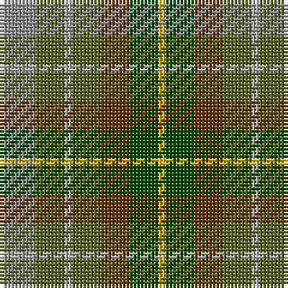

The parent of this is [Devon, Green (District)](/tartans/na/10/ga8/n2/ga8/t8/g8/y/2/)

This was sourced from tartans-authority.  It is a [7 stripes tartan](/stripes/stripes7/).

Original link http://www.tartansauthority.com/tartan-ferret/display/1284/

## Thread count
Na/10 Ga8 N2 Ga8 T8 G8 Y/2

## Palette
Each colour and its ΔE from the base-6 reference it is a variant of.

| Colour | Shade | Base | ΔE (OKLab) |
|---|---|---|---|
| G |  `#004C00` | G  | 0.08 |
| Ga |  `#5C6428` | G  | 0.09 |
| N |  `#B0B0B0` | Y  | 0.18 |
| Na |  `#8C8C8C` | R  | 0.24 |
| T |  `#64340C` | G  | 0.18 |
| Y |  `#E8C000` | Y  | 0.00 |

# Sample pattern

ID: /variants/na/10/ga8/n2/ga8/t8/g8/y/2-g004c00-ga5c6428-nb0b0b0-na8c8c8c-t64340c-ye8c000/
