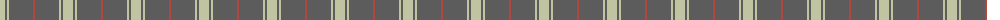
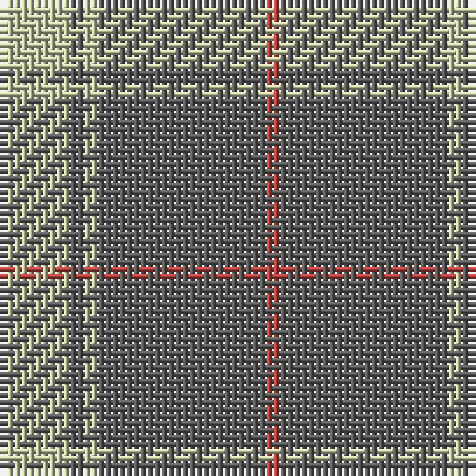

The parent of this is [Ceredigion (Personal)](/tartans/na/10/n2/na2/n24/r/2/)

This was sourced from tartans-authority.  It is a [5 stripes tartan](/stripes/stripes5/).

Original link http://www.tartansauthority.com/tartan-ferret/display/7078/

## Thread count
Na/10 N2 Na2 N24 R/2

## Palette
Each colour and its ΔE from the base-6 reference it is a variant of.

| Colour | Shade | Base | ΔE (OKLab) |
|---|---|---|---|
| N |  `#5C5C5C` | B  | 0.14 |
| Na |  `#C0C4A0` | Y  | 0.12 |
| R |  `#B44440` | R  | 0.07 |

# Sample pattern

ID: /variants/na/10/n2/na2/n24/r/2-n5c5c5c-nac0c4a0-rb44440/
