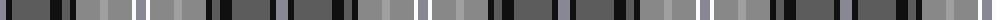

The parent of this is [Scotland Forever Antique (Fashion)](/tartans/na/12/k6/n38/k12/n8/k6/nc24/nb8/nc24/w4/na/10/)

This was sourced from tartans-authority.  It is a [11 stripes tartan](/stripes/stripes11/).

Original link http://www.tartansauthority.com/tartan-ferret/display/8276/

## Thread count
Na/12 K6 N38 K12 N8 K6 Nc24 Nb8 Nc24 W4 Na/10

## Palette
Each colour and its ΔE from the base-6 reference it is a variant of.

| Colour | Shade | Base | ΔE (OKLab) |
|---|---|---|---|
| K |  `#101010` | K  | 0.17 |
| N |  `#5C5C5C` | B  | 0.14 |
| Na |  `#888894` | R  | 0.24 |
| Nb |  `#A0A0A0` | Y  | 0.20 |
| Nc |  `#888888` | R  | 0.24 |
| W |  `#FCFCFC` | W  | 0.03 |

ID: /variants/na/12/k6/n38/k12/n8/k6/nc24/nb8/nc24/w4/na/10-k101010-n5c5c5c-na888894-nba0a0a0-nc888888-wfcfcfc/
