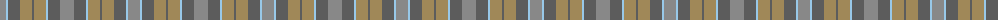

The parent of this is [Outlander #2](/tartans/na/12/lb2/n12/lt12/n2/lt12/lb2/n12/na/14/)

This was sourced from tartans-authority.  It is a [9 stripes tartan](/stripes/stripes9/).

Original link http://www.tartansauthority.com/tartan-ferret/display/11114/

## Thread count
Na/12 LB2 N12 LT12 N2 LT12 LB2 N12 Na/14

## Palette
Each colour and its ΔE from the base-6 reference it is a variant of.

| Colour | Shade | Base | ΔE (OKLab) |
|---|---|---|---|
| LB |  `#98C8E8` | W  | 0.17 |
| LT |  `#A08858` | Y  | 0.21 |
| N |  `#5C5C5C` | B  | 0.14 |
| Na |  `#888888` | R  | 0.24 |

ID: /variants/na/12/lb2/n12/lt12/n2/lt12/lb2/n12/na/14-lb98c8e8-lta08858-n5c5c5c-na888888/
