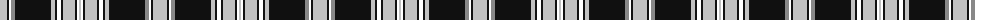

The parent of this is [Wcwm 972-2](/tartans/na/14/k2/yy2/n4/k36/na4/k2/yy4/k2/na12/k2/yy2/na/2/)

This was sourced from register-of-tartans.  It is a [13 stripes tartan](/stripes/stripes13/).

Original link https://www.tartanregister.gov.uk/tartanDetails.aspx?ref=4579

## Thread count
Na/14 K2 YY2 N4 K36 Na4 K2 YY4 K2 Na12 K2 YY2 Na/2

## Palette
Each colour and its ΔE from the base-6 reference it is a variant of.

| Colour | Shade | Base | ΔE (OKLab) |
|---|---|---|---|
| K |  `#101010` | K  | 0.17 |
| N |  `#888888` | R  | 0.24 |
| Na |  `#C0C0C0` | W  | 0.16 |

ID: /variants/na/14/k2/yy2/n4/k36/na4/k2/yy4/k2/na12/k2/yy2/na/2-k101010-n888888-nac0c0c0/
