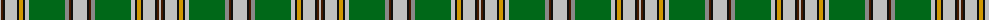

The parent of this is [Wcwm 972-1](/tartans/na/2/dr2/k2/na12/k2/dy4/k2/na4/g36/n4/dr2/k2/na/14/)

This was sourced from register-of-tartans.  It is a [13 stripes tartan](/stripes/stripes13/).

Original link https://www.tartanregister.gov.uk/tartanDetails.aspx?ref=4578

## Thread count
Na/2 DR2 K2 Na12 K2 DY4 K2 Na4 G36 N4 DR2 K2 Na/14

## Palette
Each colour and its ΔE from the base-6 reference it is a variant of.

| Colour | Shade | Base | ΔE (OKLab) |
|---|---|---|---|
| DR |  `#441800` | B  | 0.22 |
| DY |  `#D09800` | Y  | 0.11 |
| G |  `#006818` | G  | 0.02 |
| K |  `#101010` | K  | 0.17 |
| N |  `#888888` | R  | 0.24 |
| Na |  `#C0C0C0` | W  | 0.16 |

ID: /variants/na/2/dr2/k2/na12/k2/dy4/k2/na4/g36/n4/dr2/k2/na/14-dr441800-dyd09800-g006818-k101010-n888888-nac0c0c0/
