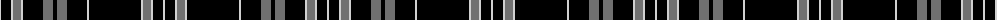

The parent of this is [Clergy](/tartans/na/2/k10/na2/n8/na2/k20/n10/k4/n10/k20/na2/k52/na2/n8/na2/k10/na/2/)

This was sourced from weddslist.  It is a [17 stripes tartan](/stripes/stripes17/).

Original link http://www.weddslist.com/cgi-bin/tartans/pg.pl?source=rb

## Thread count
Na/2 K10 Na2 N8 Na2 K20 N10 K4 N10 K20 Na2 K52 Na2 N8 Na2 K10 Na/2

## Palette
Each colour and its ΔE from the base-6 reference it is a variant of.

| Colour | Shade | Base | ΔE (OKLab) |
|---|---|---|---|
| K |  `#000000` | K  | 0.00 |
| N |  `#707070` | G  | 0.18 |
| Na |  `#D0D0D0` | W  | 0.11 |

ID: /variants/na/2/k10/na2/n8/na2/k20/n10/k4/n10/k20/na2/k52/na2/n8/na2/k10/na/2-k000000-n707070-nad0d0d0/
