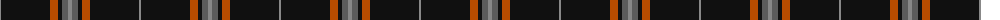

The parent of this is [Harley Davidson (Corporate)](/tartans/na/2/k49/do8/k4/n6/na/4/)

This was sourced from tartans-authority.  It is a [6 stripes tartan](/stripes/stripes6/).

Original link http://www.tartansauthority.com/tartan-ferret/display/5816/

## Thread count
Na/2 K49 DO8 K4 N6 Na/4

## Palette
Each colour and its ΔE from the base-6 reference it is a variant of.

| Colour | Shade | Base | ΔE (OKLab) |
|---|---|---|---|
| DO |  `#B84C00` | R  | 0.08 |
| K |  `#101010` | K  | 0.17 |
| N |  `#5C5C5C` | B  | 0.14 |
| Na |  `#888888` | R  | 0.24 |

# Sample pattern

ID: /variants/na/2/k49/do8/k4/n6/na/4-dob84c00-k101010-n5c5c5c-na888888/
