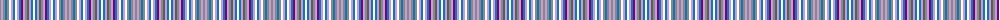

The parent of this is [Welly (Personal)](/tartans/na/2/lp2/na2/b2/na2/w2/lp2/b2/w2/lp2/b2/p2/lp2/na2/n2/lp2/b2/w/2/)

This was sourced from tartans-authority.  It is a [18 stripes tartan](/stripes/stripes18/).

Original link http://www.tartansauthority.com/tartan-ferret/display/10413/

## Thread count
Na/2 LP2 Na2 B2 Na2 W2 LP2 B2 W2 LP2 B2 P2 LP2 Na2 N2 LP2 B2 W/2

## Palette
Each colour and its ΔE from the base-6 reference it is a variant of.

| Colour | Shade | Base | ΔE (OKLab) |
|---|---|---|---|
| B |  `#1474B4` | B  | 0.15 |
| LP |  `#C49CD8` | W  | 0.24 |
| N |  `#5C5C5C` | B  | 0.14 |
| Na |  `#888888` | R  | 0.24 |
| P |  `#780078` | B  | 0.16 |
| W |  `#FCFCFC` | W  | 0.03 |

ID: /variants/na/2/lp2/na2/b2/na2/w2/lp2/b2/w2/lp2/b2/p2/lp2/na2/n2/lp2/b2/w/2-b1474b4-lpc49cd8-n5c5c5c-na888888-p780078-wfcfcfc/
