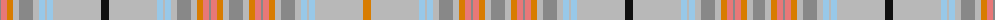

The parent of this is [Unidentified Scarlett #13](/tartans/na/2/lr6/o6/n6/na14/n6/lb6/n2/lb6/n48/k8/n48/lb6/n2/lb6/n6/na14/n6/o6/lr6/na2/lr6/o6/n6/na14/n6/o6/lr6/na2/lr6/o6/n6/na14/n6/lb6/n2/lb6/n48/o8/n48/lb6/n2/lb6/n6/na14/n6/o6/lr6/na2/lr6/o6/n6/na14/n6/o6/lr6/na2/lr6/o6/n6/na14/n6/lb6/n2/lb6/n48/k8/n48/lb6/n2/lb6/n6/na14/n6/o6/lr6/na2/lr6/o6/n6/na/12/)

This was sourced from register-of-tartans.  It is a [81 stripes tartan](/stripes/stripes81/).

Original link https://www.tartanregister.gov.uk/tartanDetails.aspx?ref=4369

## Thread count
Na/2 LR6 O6 N6 Na14 N6 LB6 N2 LB6 N48 K8 N48 LB6 N2 LB6 N6 Na14 N6 O6 LR6 Na2 LR6 O6 N6 Na14 N6 O6 LR6 Na2 LR6 O6 N6 Na14 N6 LB6 N2 LB6 N48 O8 N48 LB6 N2 LB6 N6 Na14 N6 O6 LR6 Na2 LR6 O6 N6 Na14 N6 O6 LR6 Na2 LR6 O6 N6 Na14 N6 LB6 N2 LB6 N48 K8 N48 LB6 N2 LB6 N6 Na14 N6 O6 LR6 Na2 LR6 O6 N6 Na/12

## Palette
Each colour and its ΔE from the base-6 reference it is a variant of.

| Colour | Shade | Base | ΔE (OKLab) |
|---|---|---|---|
| K |  `#101010` | K  | 0.17 |
| LB |  `#98C8E8` | W  | 0.17 |
| LR |  `#E87878` | R  | 0.19 |
| N |  `#B8B8B8` | Y  | 0.17 |
| Na |  `#888888` | R  | 0.24 |
| Nb |  `#C0C0C0` | W  | 0.16 |
| O |  `#D87C00` | Y  | 0.17 |
| R |  `#C80000` | R  | 0.00 |

ID: /variants/na/2/lr6/o6/n6/na14/n6/lb6/n2/lb6/n48/k8/n48/lb6/n2/lb6/n6/na14/n6/o6/lr6/na2/lr6/o6/n6/na14/n6/o6/lr6/na2/lr6/o6/n6/na14/n6/lb6/n2/lb6/n48/o8/n48/lb6/n2/lb6/n6/na14/n6/o6/lr6/na2/lr6/o6/n6/na14/n6/o6/lr6/na2/lr6/o6/n6/na14/n6/lb6/n2/lb6/n48/k8/n48/lb6/n2/lb6/n6/na14/n6/o6/lr6/na2/lr6/o6/n6/na/12-k101010-lb98c8e8-lre87878-nb8b8b8-na888888-nbc0c0c0-od87c00-rc80000/
