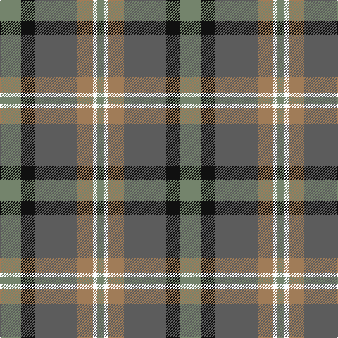

The parent of this is [McHale (Personal)](/tartans/na/30/k20/n60/lt22/w6/na/10/)

This was sourced from tartans-authority.  It is a [6 stripes tartan](/stripes/stripes6/).

Original link http://www.tartansauthority.com/tartan-ferret/display/10708/

## Thread count
Na/30 K20 N60 LT22 W6 Na/10

## Palette
Each colour and its ΔE from the base-6 reference it is a variant of.

| Colour | Shade | Base | ΔE (OKLab) |
|---|---|---|---|
| K |  `#101010` | K  | 0.17 |
| LT |  `#A07C58` | R  | 0.19 |
| N |  `#5C5C5C` | B  | 0.14 |
| Na |  `#74846C` | G  | 0.19 |
| W |  `#FCFCFC` | W  | 0.03 |

# Sample pattern

ID: /variants/na/30/k20/n60/lt22/w6/na/10-k101010-lta07c58-n5c5c5c-na74846c-wfcfcfc/
