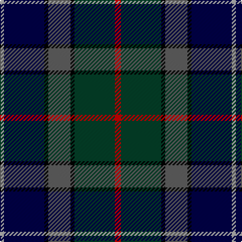

The parent of this is [Grandfather Mountain Games (District](/tartans/na/4/db40/k4/n22/k4/dg40/r/6/)

This was sourced from tartans-authority.  It is a [7 stripes tartan](/stripes/stripes7/).

Original link http://www.tartansauthority.com/tartan-ferret/display/2198/

## Thread count
Na/4 DB40 K4 N22 K4 DG40 R/6

## Palette
Each colour and its ΔE from the base-6 reference it is a variant of.

| Colour | Shade | Base | ΔE (OKLab) |
|---|---|---|---|
| DB |  `#000048` | B  | 0.21 |
| DG |  `#044028` | G  | 0.14 |
| K |  `#000000` | K  | 0.00 |
| N |  `#606060` | B  | 0.15 |
| Na |  `#B0B0B0` | Y  | 0.18 |
| R |  `#C80000` | R  | 0.00 |

# Sample pattern

ID: /variants/na/4/db40/k4/n22/k4/dg40/r/6-db000048-dg044028-k000000-n606060-nab0b0b0-rc80000/
