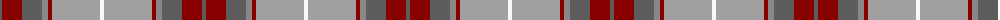
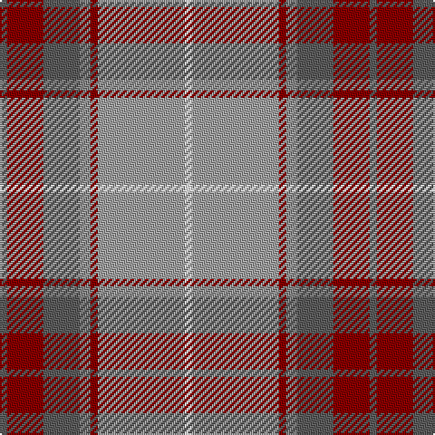

The parent of this is [Un-named Dutch](/tartans/na/4/dr20/na20/n6/dr4/nb48/w/4/)

This was sourced from register-of-tartans.  It is a [7 stripes tartan](/stripes/stripes7/).

Original link https://www.tartanregister.gov.uk/tartanDetails.aspx?ref=4426

## Thread count
Na/4 DR20 Na20 N6 DR4 Nb48 W/4

## Palette
Each colour and its ΔE from the base-6 reference it is a variant of.

| Colour | Shade | Base | ΔE (OKLab) |
|---|---|---|---|
| DR |  `#880000` | R  | 0.14 |
| N |  `#888888` | R  | 0.24 |
| Na |  `#5C5C5C` | B  | 0.14 |
| Nb |  `#A0A0A0` | Y  | 0.20 |
| W |  `#F8F8F8` | W  | 0.01 |

# Sample pattern

ID: /variants/na/4/dr20/na20/n6/dr4/nb48/w/4-dr880000-n888888-na5c5c5c-nba0a0a0-wf8f8f8/
