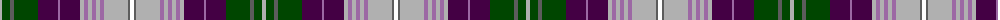

The parent of this is [Cribb (2016)](/tartans/na/4/g8/n4/g24/dp20/lp2/dp20/na4/lp4/na4/lp4/na4/lp4/na24/n2/w/4/)

This was sourced from register-of-tartans.  It is a [16 stripes tartan](/stripes/stripes16/).

Original link https://www.tartanregister.gov.uk/tartanDetails.aspx?ref=11455

## Thread count
Na/4 G8 N4 G24 DP20 LP2 DP20 Na4 LP4 Na4 LP4 Na4 LP4 Na24 N2 W/4

## Palette
Each colour and its ΔE from the base-6 reference it is a variant of.

| Colour | Shade | Base | ΔE (OKLab) |
|---|---|---|---|
| DP |  `#440044` | B  | 0.17 |
| G |  `#004600` | G  | 0.10 |
| LP |  `#9C68A4` | R  | 0.21 |
| N |  `#5C5C5C` | B  | 0.14 |
| Na |  `#B0B0B0` | Y  | 0.18 |
| W |  `#FFFFFF` | W  | 0.03 |

ID: /variants/na/4/g8/n4/g24/dp20/lp2/dp20/na4/lp4/na4/lp4/na4/lp4/na24/n2/w/4-dp440044-g004600-lp9c68a4-n5c5c5c-nab0b0b0-wffffff/
