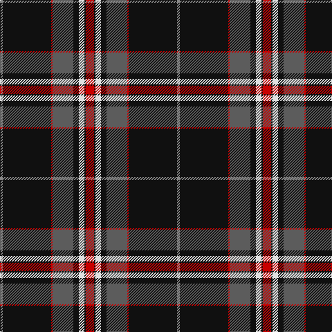

The parent of this is [Distripress (Corporate)](/tartans/na/4/k70/r2/n30/k8/ln8/k2/r/12/)

This was sourced from tartans-authority.  It is a [8 stripes tartan](/stripes/stripes8/).

Original link http://www.tartansauthority.com/tartan-ferret/display/10697/

## Thread count
Na/4 K70 R2 N30 K8 LN8 K2 R/12

## Palette
Each colour and its ΔE from the base-6 reference it is a variant of.

| Colour | Shade | Base | ΔE (OKLab) |
|---|---|---|---|
| K |  `#101010` | K  | 0.17 |
| LN |  `#E0E0E0` | W  | 0.06 |
| N |  `#5C5C5C` | B  | 0.14 |
| Na |  `#888888` | R  | 0.24 |
| R |  `#C80000` | R  | 0.00 |

# Sample pattern

ID: /variants/na/4/k70/r2/n30/k8/ln8/k2/r/12-k101010-lne0e0e0-n5c5c5c-na888888-rc80000/
