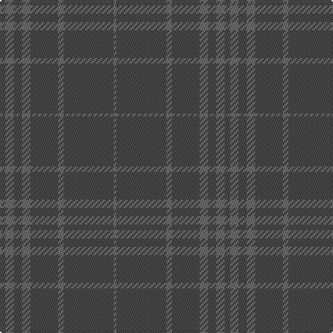

The parent of this is [Hebridean Cairn Fashion Tartan Tartan Number: 6822. Earliest known date: 2005 For a new House of Edgar Collection in wedding gray. See products available Copyright © Blair Urquhart, Comrie, 2015](/tartans/na/4/nb6/na6/nb6/na20/nb4/na36/nb/2/)

This was sourced from house-of-tartan.  It is a [8 stripes tartan](/stripes/stripes8/).

Original link http://www.house-of-tartan.scotland.net/house/TartanViewjs.asp?colr=Def&tnam=6822

## Thread count
Na/4 Nb6 Na6 Nb6 Na20 Nb4 Na36 Nb/2

## Palette
Each colour and its ΔE from the base-6 reference it is a variant of.

| Colour | Shade | Base | ΔE (OKLab) |
|---|---|---|---|
| N |  `#888888` | R  | 0.24 |
| Na |  `#484848` | B  | 0.12 |
| Nb |  `#6C6C6C` | G  | 0.18 |

# Sample pattern

ID: /variants/na/4/nb6/na6/nb6/na20/nb4/na36/nb/2-n888888-na484848-nb6c6c6c/
