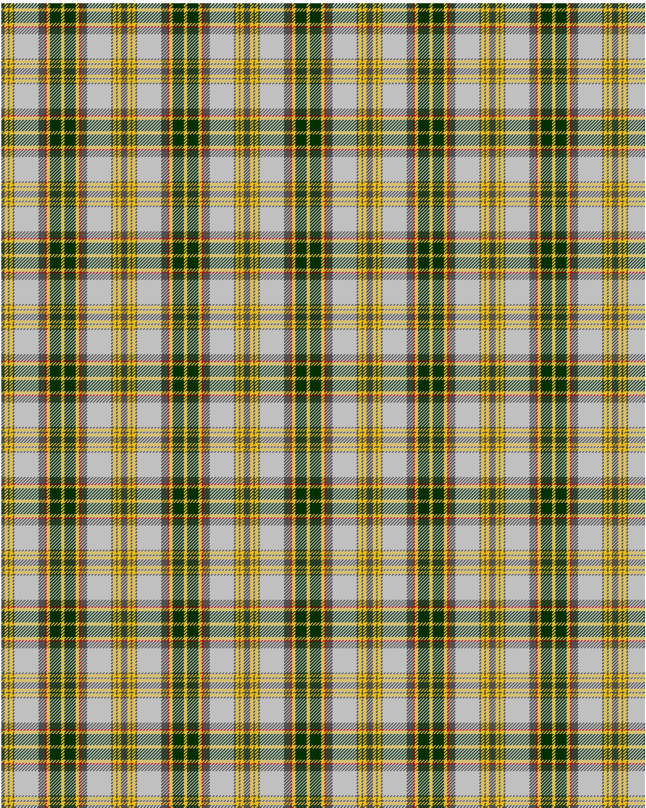

Hutt Tartan

This was sourced from <no value>.  It is a 11 stripes tartan.

Original link http://www.weddslist.com/cgi-bin/tartans/pg.pl?source=sts

## Thread count
NA/4 Y4 NA2 Y4 NA2 N30 NA8 R2 Y4 DG14 Y/2

## Palette
DG#003000 N#C0C0C0 NA#505050 R#C00000 Y#F0C000

# Sample pattern

ID: /variants/na/4/y4/na2/y4/na2/n30/na8/r2/y4/dg14/y/2-dg003000-nc0c0c0-na505050-rc00000-yf0c000